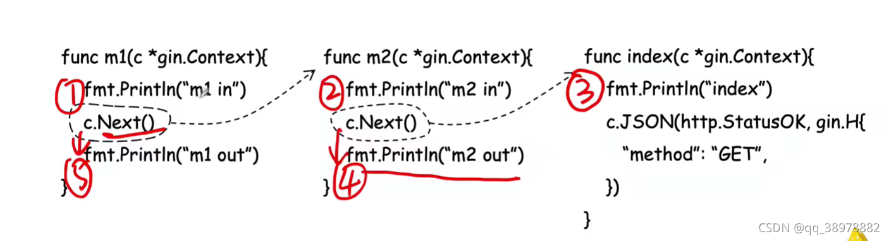
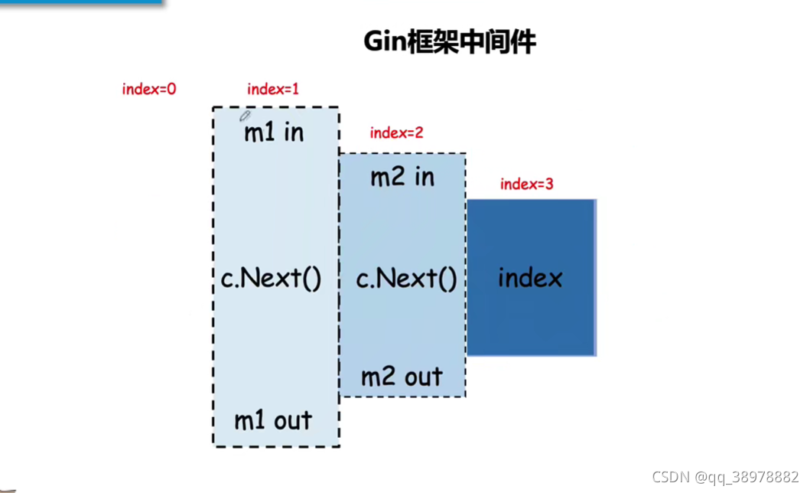

# linux

### 常用命令
1. ps
2. kill
3. ip
4. netstat
5. scp
6.

## 开发所用库
1. RPC框架 [kite](https://github.com/koding/kite )/[kitex](https://github.com/cloudwego/kitex ), [gRPC](https://grpc.io/docs/)
2. Web框架 [gin](https://gin-gonic.com/)
3. ORM框架 [gorm](https://gorm.io/)
4. Mock框架 [gomock](https://github.com/golang/mock) /[testify/mock](https://github.com/stretchr/testify )/ [goconvey](https://github.com/smartystreets/goconvey )。mock本质上是对测试过程中所依赖的一些函数/接口进行接管， 即便真实调用尚未实现/不可直接调用也可以返回预期值。
   如何编写可mock的代码
   1. mock 作用的是接口，因此将依赖抽象为接口，而不是直接依赖具体的类。
   2. 不直接依赖的实例，而是使用依赖注入降低耦合性。
6. 断言库 [assert](https://github.com/stretchr/testify)
7. flag包 [pflag](https://github.com/spf13/pflag)
8. validate [govalidator](http://github.com/asaskevich/govalidator)
9. websocket [websocket](https://github.com/gorilla/websocket)
10. redis key-value存储 [redis](https://redis.io/)
11. yaml [yaml.v3](https://gopkg.in/yaml.v3)
12. pretty [pretty](https://github.com/kr/pretty)

## 常用技术
1. 稳定性：缓存、降级、限流（熔断，[hystrix-go](https://gitee.com/mirrors/hystrix-go )，[uber rate limit](https://pkg.go.dev/go.uber.org/ratelimit )，[go x rate](https://pkg.go.dev/golang.org/x/time/rate )）
2. 池化（线程、协程、连接池）
3. 缓存cache（ [freecache](https://github.com/coocood/freecache )、 [groupcache](https://github.com/golang/groupcache )、[bigcache](https://github.com/allegro/bigcache) ，此外还有fastcache、offheap、ristretto等）
4. docker（[Docker镜像仓库](https://hub.docker.com/search?image_filter=official&q=) ,[Docker文档](https://docs.docker.com/get-started/overview/) ,[go docker库](https://github.com/moby/moby )）
5. kafka/rocketmq([官网](https://rocketmq.apache.org/ )，[控制面板](https://github.com/apache/rocketmq-dashboard )，使用参考go rocketmq examples)
6. k8s（全称Kubernetes，[Kubernetes](https://kubernetes.io/) ）
7. Elasticsearch
8. nginx
9. 监控[prometheus](https://prometheus.io/ )以及[grafana](https://grafana.com/ )

## 设计
1. [设计模式](./docs/design_pattern.md )

## 中间件执行顺序
同一个中间件，他的前置逻辑越早执行，他的后置逻辑执行的越晚。





# 项目
1. [6.824](http://nil.csail.mit.edu/6.824/2020/schedule.html)
2. 数据库项目

## Docker
### 1. 常用命令
#### 1.1 安装
```bash
# 卸载旧版
sudo apt-get remove docker docker-engine docker.io containerd runc

# 安装证书并添加源
sudo apt update
sudo apt-get install ca-certificates curl gnupg lsb-release
curl -fsSL http://mirrors.aliyun.com/docker-ce/linux/ubuntu/gpg | sudo apt-key add -

# 添加源
sudo add-apt-repository "deb [arch=amd64] http://mirrors.aliyun.com/docker-ce/linux/ubuntu $(lsb_release -cs) stable"

# 安装
sudo apt-get install docker-ce docker-ce-cli containerd.io

# 启动
systemctl start docker
```
#### 1.2 命令
```bash
# 拉镜像
docker pull nginx  # 默认最新版
docker pull nginx:1.20.1 # 指定版本

# 查看镜像
docker images

# 移除镜像
docker rmi 镜像名:版本号/镜像id

# 启动容器
docker run [OPTIONS] IMAGE [COMMAND] [ARG...]

#【docker run  设置项   镜像名  】 镜像启动运行的命令（镜像里面默认有的，一般不会写）
# -d：后台运行
# --restart=always: 开机自启
docker run --name=mynginx   -d  --restart=always -p  88:80   nginx

# 查看正在运行的容器
docker ps

# 查看所有
docker ps -a

# 删除容器
docker rm  容器id/名字
docker rm -f mynginx   #强制删除正在运行中的

#停止容器
docker stop 容器id/名字

#再次启动
docker start 容器id/名字

#应用开机自启
docker update 容器id/名字 --restart=always

# 进入容器内部的系统，修改容器内容
docker exec -it 容器id  /bin/bash

docker run --name=mynginx   \
-d  --restart=always \
-p  88:80 -v /data/html:/usr/share/nginx/html:ro  \ # 主机目录:容器
nginx

# 提交修改
docker commit [OPTIONS] CONTAINER [REPOSITORY[:TAG]]
docker commit -a "username"  -m "首页变化" 341d81f7504f mynginx:v1.0

# 将镜像保存成压缩包
docker save -o abc.tar mynginx:v1.0

# 别的机器加载这个镜像
docker load -i abc.tar

# 打tag并推送远端
docker tag local-image:tagname new-repo:tagname
docker push new-repo:tagname

# 把旧镜像的名字，改成仓库要求的新版名字
docker tag guignginx:v1.0 leifengyang/guignginx:v1.0

# 登录到docker hub
docker login       
docker logout（推送完成镜像后退出）

# 推送
docker push leifengyang/guignginx:v1.0


# 容器->主机
docker cp 5eff66eec7e1:/etc/nginx/nginx.conf  /data/conf/nginx.conf
# 主机->容器
docker cp  /data/conf/nginx.conf  5eff66eec7e1:/etc/nginx/nginx.conf
```

#### 2. minikube
https://minikube.sigs.k8s.io/docs/start/

https://www.jeeinn.com/2022/07/1715/

minikube stop

minikube delete

minikube start --kubernetes-version=v1.23.8


### 1. 缓存穿透、击穿、雪崩
+ 穿透：指查询一个缓存和数据库都不存在的数据，导致尽管数据不存在但是每次都会到数据库查询，在访问量大的时候数据库可能挂掉。
+ 击穿：单个key值的缓存失效过期
+ 雪崩：redis缓存中大量的key同时失效，同时刚好有大量的请求，会直接访问数据库，造成数据库阻塞甚至宕机

### 2. 消息队列
+ 异步
+ 削峰
+ 解耦

//  mockgen -source=foo.go -package=mock -destination mock_foo.go


goland无限试用，ide-eval-reset，2021.2.2及之前版本。

## 计划
## 1. 后端
## 2. 嵌入式：树莓派->电机控制->四旋翼

#### [设计模式](./docs/design_pattern.md)
#### [Golang](./docs/golang.md)

#### 基础服务

containerd/lazy load/sidecar/daemonset

linux settings 
```bash
sudo apt-get install ntpdate					//在Ubuntu下更新本地时间
sudo ntpdate time.windows.com
sudo hwclock --localtime --systohc			//将本地时间更新到硬件上
```

## MySql
0. mariadb安装及设置
### 注意mysql和mariadb使用配置文件目录不同
### 主从备份需要手动创建数据库及数据表。
sudo apt-get install mariadb-server
切换root用户
使用mysql_secure_installation命令设置密码
设置新用户，并为其授权远程登录：
修改sudo vim /etc/mysql/mariadb.conf.d/50-server.cnf
重启服务  sudo systemctl restart mariadb.service
1. mysql 只能使用root登录
   alter user 'root'@'localhost' identified with mysql_native_password by '123456';
2. mysql 修改密码 
mysql -u root update mysql.user set authentication_string=PASSWORD('123456') where User='root'; flush privileges;
   set password for root@localhost = password('123456'); flush privileges;
3. mysql 创建用户并授权某个数据库:
```sql
CREATE USER 'test'@'localhost' IDENTIFIED BY '123456';
update user set host='%' where user='test';
grant all privileges on test.* to 'test'@'%'; --（两次）

```

4. MySql执行sql文件，a. source xxx.sql  b. mysql -u用户名 -p用户密码 < xxx.sql 
   

## redis
#### 1.简介
+ Redis支持数据的持久化，可以将内存中的数据保存在磁盘中，重启的时候可以再次加载使用。
+ Redis不仅支持简单的key-value类型的数据，同时还提供了list、set、zset、hash等数据结构的存储。
+ Redis支持数据的备份，即master-slave模式的数据备份。

#### 2. 打开客户端
+ 打开Redis客户端
```bash
redis-cli

redis-cli -h host -p port -a password
```

#### 3. Redis键（key）
相关命令：
```bash
SET runoobkey redis       # key=runoobkey，value=redis
GET runoobkey             # redis
DEL key                   # key存在的话删除key
EXISTS key                # 检查key是否存在
DUMP key                  # 序列化给定key，并返回序列化的值
EXPIRE key seconds        # 设置过期时间
EXPIREAT key timestamp
PEXPIRE key milliseconds  
PEXPIRE key milliseconds-timestamp
KEYS pattern
MOVE key db
PERSIST key
PTTL key
TTL key
RANDOMKEY
RENAME key newkey
RENAMENX key newkey
SCAN cursor [MATCH pattern] [COUNT count]
TYPE key
```

#### 4. Redis字符串（String）
value为string
```bash
SET key value
GET key
GETRANGE key start end
GETSET key value
GETBIT key offset
MGET key1 [key2...]
SETBIT key offset value
....
```

#### 5. Redis哈希（Hash）
value为哈希表
```bash
HMSET rbkey name "redis tutorial" description "redis basic commands" likes 20 visitors 23000

HDEL key field1 [field2]         # 删除哈希表中的一个字段
HGET key field                   # 获取哈希表中的一个字段
HGETALL key
HINCRBY key field increment
HKEYS key
HMGET key field1 [field2]
HMSET key field1 value1 [field2 value2]
HSET key field value
HSETNX key field value
HVALS key
HSCAN key cursor [MATCH pattern] [COUNT count]
```

#### 6. Redis列表
```bash
LPUSH runoobkey redis
LRANGE runoobkey 0 10
BLPOP key1 [key2] timeout
BRPOP key1 [key2] timeout
LINDEX key index
LINSERT key BEFORE|AFTER pivot value
LLEN key
LPOP key
LPUSH key value1 [value2]
LPUSHX key value
LRANGE key start stop
LREM key count value
LSET key index value
LTRIM key start stop
RPOP key
RPOPLPUSH source destination
RPUSH key value1 [value2]
RPUSHX key value
```

#### 7. Redis集合（SET）
无序集合，元素不能重复。
```bash
SADD key value
SMEMBERS key
SCARD key
SDIFF key1 [key2]
SDIFFSTORE destination key1 [key2]
SINTER key1 [key2]
SINTERSTORE destination key1 [key2]
SISMEMBER key member
SMEMBERS key
SMOVE source destination member
SPOP key
SRANDMEMBER key [count]
SREM key member1 [member2]
SUNIONSTORE destination key1 [key2]
SSCAN key cursor [MATCH pattern] [COUNT count]
```

#### 8. Redis有序集合（sorted set）
有序集合和集合一样也是string类型元素的集合，且不允许重复的成员。不同的是每个元素都会关联一个double类型的分数，redis这是通过分数来为集合中的成员进行从小到大的排序。
```bash
ZADD runoobkey 1 redis
ZRANGE runoobkey 0 10 WITHSCORES

ZCARD key              # 获取成员数
ZCOUNT key min max     # 分数在min、max之间的成员数
ZINCRBY key increment member
ZINTERSTORE destination numkeys key [key ...]
ZLECOUNT key min max
ZRANGE key start stop [WITHSCORES]
ZRANGEBYLEX key min max [LIMIT offset count]
ZRANGESCORE key min max [WITHSCORES] [LIMIT]
ZRANK key member
ZREM key member[member...]
....

```