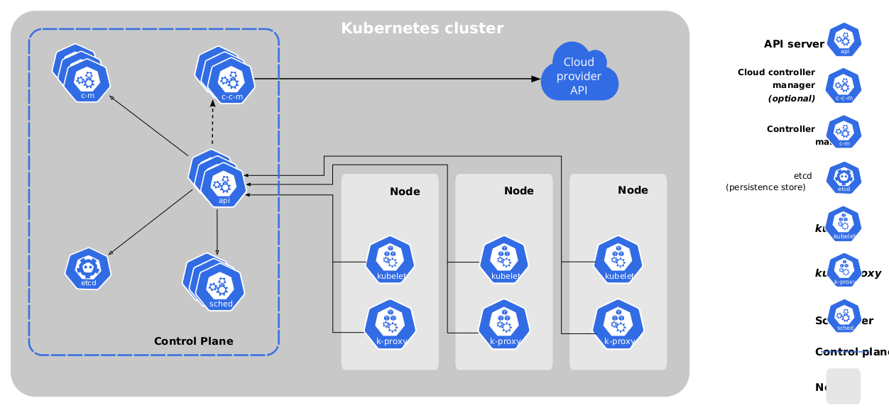

## 一、安装
[kubernetes.io](https://kubernetes.io/)
[kubectl-commands](https://kubernetes.io/docs/reference/generated/kubectl/kubectl-commands#create)
### 1. 准备
```shell
swapoff -a      //关闭swap，立即生效

vim /etc/fstab  //关闭swap
```

### 2.下载安装containerd和runc
[containerd](https://github.com/containerd/containerd/blob/main/docs/getting-started.md)

安装containerd
```shell
wget https://github.com/containerd/containerd/releases/download/v1.7.10/containerd-1.7.10-linux-amd64.tar.gz

tar Cxzvf /usr/local containerd-1.7.10-linux-amd64.tar.gz

mkdir -p /usr/local/lib/systemd/system

wget https://raw.githubusercontent.com/containerd/containerd/main/containerd.service

cp containerd.service /usr/local/lib/systemd/system/containerd.service

systemctl daemon-reload

systemctl enable --now containerd

mkdir -p /opt/cni/bin

tar Cxzvf /opt/cni/bin cni-plugins-linux-amd64-v1.4.0.tgz
```
安装runc
```shell
wget https://github.com/opencontainers/runc/releases/download/v1.1.10/runc.amd64

install -m 755 runc.amd64 /usr/local/sbin/runc

mkdir -p /etc/containerd

containerd config default > /etc/containerd/config.toml

vim /etc/containerd/config.toml // 修改SystemdGroup为true

sudo systemctl restart containerd
```

### 3. 安装kubelet、kubeadm、kubectl
```shell
apt-get update && apt-get install -y apt-transport-https

curl https://mirrors.aliyun.com/kubernetes/apt/doc/apt-key.gpg | apt-key add - 

cat <<EOF >/etc/apt/sources.list.d/kubernetes.list
deb https://mirrors.aliyun.com/kubernetes/apt/ kubernetes-xenial main
EOF

apt-get update

apt-get install -y kubelet kubeadm kubectl
```

### 4. 初始化集群，安装网络组件
```shell
hostnamectl set-hostname master01  

cat <<EOF |tee /etc/modules-load.d/k8s.conf
overlay
br_netfilter
EOF

sudo modprobe overlay

sudo modprobe br_netfilter

# sysctl params required by setup, params persist across reboots
cat <<EOF |tee /etc/sysctl.d/k8s.conf
net.bridge.bridge-nf-call-iptables  = 1
net.bridge.bridge-nf-call-ip6tables = 1
net.ipv4.ip_forward                 = 1
EOF

# Apply sysctl params without reboot
sudo sysctl --system

kubeadm config images pull --image-repository registry.aliyuncs.com/google_containers

vim /etc/containerd/config.toml // sandbox : registry.aliyuncs.com/google_containers/pause:3.9

sudo kubeadm init --pod-network-cidr=10.244.0.0/16 --image-repository registry.aliyuncs.com/google_containers

wget https://github.com/flannel-io/flannel/releases/latest/download/kube-flannel.yml
kubectl apply -f kube-flannel.yml

```

### 5. 安装dashboard
```shell
git clone https://github.com/kubernetes/dashboard
kubectl apply -f aio/deploy/recommended.yaml  

#type：ClusterIP修改为NodePort
kubectl edit svc kubernetes-dashboard -n kubernetes-dashboard  

kubectl get svc -A |grep kubernetes-dashboard 

# 创建admin-user用户，https://github.com/kubernetes/dashboard/blob/master/docs/user/access-control/creating-sample-user.md
kubectl apply -f create-admin-user.yaml

kubectl apply -f create-role-binding.yaml

kubectl -n kubernetes-dashboard create token admin-user
```

create-admin-user.yaml
```yml
apiVersion: v1
kind: ServiceAccount
metadata:
  name: admin-user
  namespace: kubernetes-dashboard
```

create-role-binding.yaml
```yml
apiVersion: rbac.authorization.k8s.io/v1
kind: ClusterRoleBinding
metadata:
  name: admin-user
roleRef:
  apiGroup: rbac.authorization.k8s.io
  kind: ClusterRole
  name: cluster-admin
subjects:
- kind: ServiceAccount
  name: admin-user
  namespace: kubernetes-dashboard
```


### 6. minikube
https://minikube.sigs.k8s.io/docs/start/

https://www.jeeinn.com/2022/07/1715/

minikube stop

minikube delete

minikube start --kubernetes-version=v1.23.8

## 二、主要组件
 

### 控制面组件
### 1. API server(kube-apiserver)
API server是k8s控制面中的一个组件，暴露k8s API，是k8s控制面的前端。其主要实现是kube-apiserver，可以水平
缩放，通过部署更多的实例来进行缩放。可以运行多个kube-apiserver，并在实例间进行负载均衡。

### 2. etcd
完备、高可用key-value存储，用于k8s后端存储所有的集群数据。

### 3. kube-scheduler
用于监听新创建的Pods和未分配的node，并选择node来运行这些Pod。调度时考虑的因素：资源需求、硬件/软件/策略约束、亲和/反亲和要求、数据局部性、工作负载间的影响及生命周期。

### 4. kube-controller-manager
是运行controller进程的控制面组件。每个controller是一个单独的过程，但是都被编译成一个二进制文件，在一个进程中运行。

### 节点组件
### 5. kubelet

### 6. kube-proxy
维护节点网络规则，网络规则允许从集群内或者从集群外通过网络连接访问Pod。
## 三、基础概念

### 1. Master节点
### 2. Node节点
```sh
kubectl get node
kubectl describe node worker02
```
### 3. Namespace
### 4. Pod
```sh
kubectl get pod -A
kubectl get pod -n test  
kubectl get pods -A -o wide
kubectl describe pod mynginx -n test
kubectl logs mynginx -n test
kubectl exec -it mynginx -n test -- /bin/bash
```

```yaml
kind: Pod
apiVersion: v1
metadata:
  name: mynginx
  containers:
    - name: mynginx
      image: nginx
```

```yaml
apiVersion: v1
kind: Pod
metadata:
  labels:
    run: myapp
  name: myapp
spec:
  containers:
  - image: nginx
    name: nginx
  - image: tomcat
    name: tomcat
```
### 5. Label和Selector
### 6. Replication Controller和ReplicaSet
### 7. Deployment
### 8. Statement
### 9. DaemonSet
### 10. ConfigMap
### 11. Seret
### 12. HPA
### 13. Storage
### 14. Service
### 15. Ingress
### 16. Taint和Tolerant
### 17. RBAC
### 18. CronJob

## 四、源码